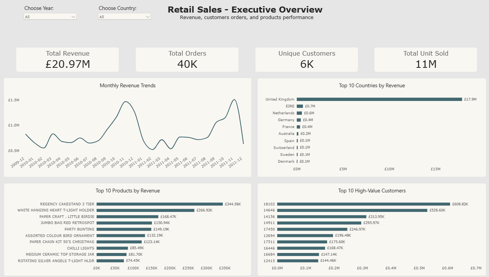
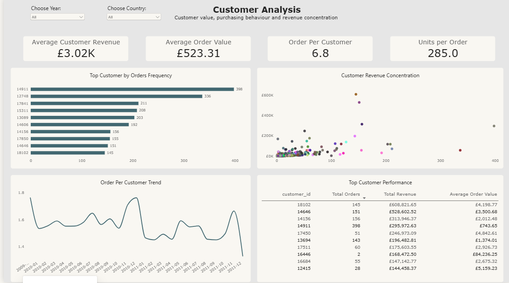
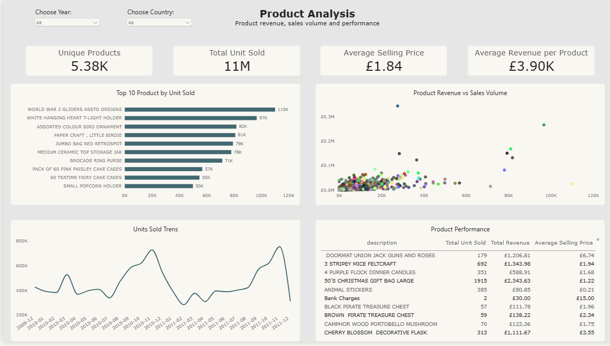

# Retail Sales Analysis & Power BI Dashboard

## Project Overview

This project analyzes retail transaction data to understand sales performance, customer behavior, and product performance.

The project combines SQL for data analysis and preparation with Power BI and DAX to create an interactive three-page dashboard.

## Dashboard Pages

### 1. Executive Overview

Provides a high-level view of overall business performance, including:

- Revenue
- Orders
- Customers
- Sales trends
- Country performance
- Product performance

### 2. Customer Analysis

Focuses on customer purchasing behavior and value, including:

- Average Customer Revenue
- Average Order Value
- Orders per Customer
- Units per Order
- Customer order frequency
- Customer revenue concentration
- Customer performance details
- Orders per Customer trend

### 3. Product Analysis

Examines product sales and revenue performance, including:

- Unique Products
- Total Units Sold
- Average Selling Price
- Average Revenue per Product
- Top products by units sold
- Product revenue vs. sales volume
- Units Sold trend
- Product performance details

## Tools & Technologies

- SQL
- Microsoft Power BI
- DAX

## Key Skills Demonstrated

- Data cleaning and preparation
- SQL analysis
- Data modeling
- DAX measures
- KPI development
- Interactive dashboard design
- Customer analysis
- Product analysis
- Business-focused data visualization

## Dashboard Preview

### Executive Overview

 

### Customer Analysis

 

### Product Analysis

 

## Project Objective

The objective of this project is to transform raw retail transaction data into clear, interactive insights that can support business decision-making.
